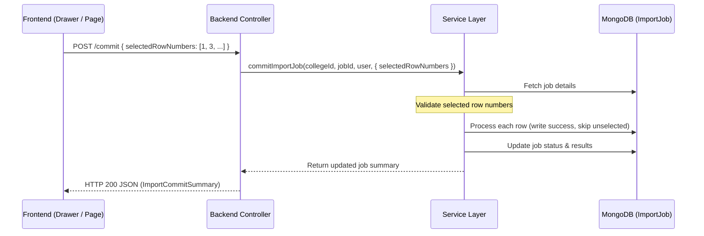

# Bulk Import Per-Row Selection Design

This document details the architectural design and implementation details for enabling per-row selection before committing a bulk import job.

## Problem
Previously, the bulk-import commit process was all-or-nothing: once a file was uploaded and parsed, all valid/eligible rows were automatically committed. There was no way for the operator to select or exclude individual eligible rows before committing the bulk import.

## Solution Architecture

## Chosen Approach
The client sends an array of selected 1-based row numbers (`selectedRowNumbers: number[]`) as part of the commit request body. 

## Why This Approach
Sending a simple array of lightweight integer identifiers (row numbers) is extremely fast, token-efficient, and requires minimal bandwidth even at the ceiling limit of 10,000 rows (a few kilobytes of integers). It allows the client and server to uniquely reference rows in $O(1)$ lookup time using Set data structures.

## Alternatives Rejected

### 1. Sending complete selected row objects back to the backend
* **Why rejected**: Sending the full row payload back for all selected rows (up to 10,000 rows) would inflate payload size dramatically, consume excessive network bandwidth, and increase server-side parsing latency. The server already has the raw row objects saved in the `ImportJob` document, so sending them again is redundant.

### 2. Sending excluded row numbers instead of selected row numbers
* **Why rejected**: Sending selected row numbers is safer. If the payload format gets corrupted or truncated, it is better to fail-closed (importing nothing) than to fail-open (importing everything that wasn't successfully marked as excluded). It also matches the UI representation where checked items represent positive selections.

### 3. Storing selection state permanently in the database during preview
* **Why rejected**: Storing selection state on the database dynamically as the user toggles checkboxes in the browser would introduce excessive write requests, latency, and session-state complexity on the backend. Keeping this state in client React memory until the final commit action is cleaner and more stateless.

## Server Validation
Row identifiers sent by the client are strictly validated:
1. **Tenant Scope**: The job is loaded matching the operator's active `collegeId` and `jobId`, preventing cross-tenant manipulation.
2. **Identifier Existence**: The server checks that every row number in the client's selection array exists within the database results of the job. If not, it throws an `AppError(400)`.
3. **Selection Eligibility**: The server checks that every selected row number maps to a row with an original `success` validation outcome (i.e. not `blocked` and not `error`). Attempting to commit a blocked or error row throws an `AppError(400)`.

## Skipped Rows
* **Skipped is not failed**: Rows that were eligible but not selected by the operator are excluded from write side-effects. Their outcome is updated to `'skipped'`, and notes are set to `['skipped - not selected by operator']`.
* **History Preservation**: Skipped rows remain in `ImportJob` history and are returned in job logs so operators have a complete audit trail of what was excluded.
* **No failure inflation**: Skipped rows do not increment the failure or blocked counts.

## Backward Compatibility
The selection payload field `selectedRowNumbers` is optional. If omitted (or `undefined`), the import service commits all eligible rows, maintaining complete backward compatibility with older API clients or screens that have not implemented row-level selection UI.

## Large Files
* **Commit ceiling**: The commit path handles the full 10,000-row ceiling. The server converts the incoming selection array into a `Set<number>`, so row inclusion is an $O(1)$ check inside the existing loop.
* **Selection ceiling is lower, and is disclosed.** The preview renders a capped
  display slice — `PREVIEW_SUCCESS_LIMIT` (50) valid rows plus every error row.
  Rows past that cap are still eligible and still imported, but they have no
  checkbox and cannot be excluded from this screen. Both screens now show a
  notice naming how many rows that affects; the operator is told rather than
  left to wonder why "300 of 300 selected" sits above a table of 50.
* **Selection source**: the client selects from `eligibleRowNumbers`, returned
  explicitly by the preview endpoint. It deliberately does **not** derive the
  list from `previewRows` (which is capped, so the selection would silently
  drop rows) nor from `job.results` (the raw job document, which carries every
  row's raw input and is megabytes on a large import — `jobSummary` exists
  precisely to avoid putting that on the wire).
* **Not addressed**: making the full row set selectable needs a paginated or
  virtualised preview, which is a larger change than this one. Raising the cap
  instead would grow the preview payload for every import, selection or not.

## Scope
* **Unrelated warning fixes**: Unrelated warnings about fee-structure mismatches, program configurations, or guardian schemas are out of scope.
* **Schema definitions modification**: Column schemas and CSV templates remain unchanged.

## Excluded rows are not deferred — they are dropped
A job is single-use: `commitImportJob` refuses anything not in `preview_ready`
and moves the job to `completed`/`partial` when it finishes. There is therefore
no way to come back and commit the rows that were unticked — the operator has to
re-upload a file containing them. Making jobs resumable would mean new lifecycle
states, partial-commit semantics, and a decision about how stale a row's `raw`
may be against live data by the time it is finally committed. That is out of
scope here, but it is a real limitation of the feature as shipped and worth
saying plainly rather than leaving the operator to assume "skipped" means "later".

## Issues Found
* `previewRows` being a capped slice is easy to mistake for the full row set;
  this feature is the first thing that depended on the distinction. Addressed
  above by returning `eligibleRowNumbers` explicitly.
* The preview endpoint returns the raw `IImportJob` (including every row's raw
  input), which the commit/history endpoints deliberately avoid via `jobSummary`.
  Not changed here — it predates this work — but it is the reason this feature
  does not read `job.results` from the client.
